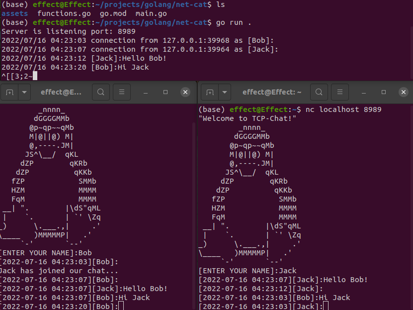

## Description
This project implements net-cat to create small chat using golang.

## Usage: how to run?

Clone this repository to your local machine. Then `cd net-cat` and type `go run .`  
After server starts on default port `:8989` or you can specify port by `go run . $port`   
It opens tcp connection which starts listening on specified port.  
You can connect from other terminal or other PC using `nc $hostip $port`  

## Implementation  

Users stored in map as [net.Conn]string (pointer to connection and nickname of user)  
Project contains goroutines to call function every time when someone connects to server  
and mutexes to lock access of other goroutines whenever someone connects or disconnects  
from sever. Everything gets logged in server terminal. Chathistry loads for new users.  
Empty messages are not shown to other users.